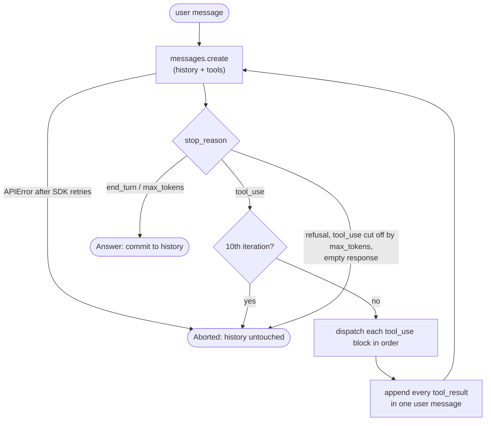

# toolloop

A terminal chat assistant that uses tools through Claude, built without an agent
framework. The agent loop, the four tools, their JSON schemas and the error
handling are all written by hand on top of the Anthropic Messages API, so it's
easy to follow how a tool-using agent actually works.

- **Hand-written loop:** call the model, run the tools it asks for, send the
  results back, and repeat until it answers. There's no `tool_runner` and no
  LangChain.
- **Four tools:** calculator, file reader, web search and current weather. Each
  one is a plain Python function with its JSON Schema written next to it.
- **Deliberate error handling:** the model sees failures it can act on, bugs get
  logged with a traceback, and conversation history is never left half-written.

## Quick start

You need Python 3.13 and [uv](https://docs.astral.sh/uv/).

1. Get the two API keys:
   - **Anthropic:** create one at
     [console.anthropic.com/settings/keys](https://console.anthropic.com/settings/keys).
   - **Tavily** (web search): sign up at [tavily.com](https://tavily.com). The
     free plan needs no credit card, and your key is on the dashboard. Each
     search uses 1 credit.
2. Copy the example env file and fill in both keys:

   ```sh
   cp .env.example .env
   ```

   Real environment variables take precedence over `.env`. If either key is
   missing, the app refuses to start and names the missing ones.

3. Run it:

   ```sh
   uv run toolloop
   uv run toolloop --model claude-opus-5-5   # default: claude-sonnet-5
   ```

In the REPL, `/clear` resets the conversation. `/exit`, Ctrl-D or Ctrl-C at the
prompt quits, and Ctrl-C while the model is working cancels just that turn.

## Sample session

The session below was run from the repo root. Dim `→` lines show each tool call,
and red `✗` lines show each tool failure.

```text
> What's the weather in Mostar right now, in Fahrenheit too?
→ get_weather(city='Mostar')
→ calculator(expression='28.7 * 9/5 + 32')
→ calculator(expression='27.7 * 9/5 + 32')
The weather in Mostar right now:

 • Condition: Clear sky
 • Temperature: 28.7 °C (83.7 °F), feels like 27.7 °C (81.9 °F)
 • Wind: 4.0 km/h
 • Precipitation: 0.0 mm in the last 15 minutes
> Which Python version does pyproject.toml require, and what's the latest stable Python release?
→ read_file(path='pyproject.toml')
→ web_search(query='latest stable Python release version')

 • pyproject.toml requirement: requires-python = ">=3.13" - so it needs Python 3.13 or
   newer.
 • Latest stable Python release: Python 3.14.7, per python.org (with 3.14.x being the
   current bugfix branch as of the Python Developer's Guide).
> What is 2**5000 exactly?
→ calculator(expression='2**5000')
✗ calculator: Result is too large (over 1000 digits)
The calculator can't compute this exactly - 2**5000 has roughly 1,506 digits, which
exceeds its 1000-digit limit, so it returned an error rather than a result. I don't have
a way to produce the exact value within that constraint.
```

The first two turns chain several tools. In the last one the tool fails: the
model gets the error as a tool result and reports it instead of guessing, and the
REPL carries on.

## Tools

| Tool          | Backed by                              | Limits                                                                   |
| ------------- | -------------------------------------- | ------------------------------------------------------------------------ |
| `calculator`  | An AST walker (never `eval()`)         | Whitelisted `math` functions, a 1000-digit cap, exponent bombs rejected  |
| `read_file`   | The local filesystem                   | Only under the working directory, no hidden paths, UTF-8 only, 50 KB cap |
| `get_weather` | Open-Meteo (no key)                    | Current conditions only, metric, top geocoding match                     |
| `web_search`  | Tavily (`POST /search`, plain `httpx`) | 5 results, each a title, URL and snippet of up to 1000 characters        |

Each tool caps its own output, so history grows at a bounded rate without
needing trimming. The system prompt tells the model to answer only from tool
results, so every answer can be traced to a line in the trace.

## Architecture

```text
src/toolloop/
  cli.py        entry point: flags, config, logging, the tool registry
  config.py     the only reader of os.environ; returns a frozen Config
  repl.py       input loop, spinner, trace lines, Markdown answers
  agent.py      run_turn: the agent loop and the system prompt
  dispatch.py   ToolError and dispatch: runs one tool call and classifies failures
  tools/        calculator, file_reader, weather, web_search
```

The registry is a plain dict mapping a tool name to its `(schema, function)`
pair. The schemas go to the API as they are, and the functions are called with
the model's arguments.

### The loop

`run_turn` in `agent.py` handles one user message:



The loop works on a copy of the history plus the new message. It writes the copy
back only when it returns an `Answer`. Every other way a turn can end (an
`Aborted` result, an API error that escapes the SDK's retries, Ctrl-C during a
tool) leaves the caller's history exactly as it was before the turn. This is
"commit on success": no failure has to clean anything up. It also keeps history
valid by construction, because every `tool_use` saved there always has its
`tool_result` in the next message.

### Error taxonomy

Failures fall into three kinds, and each is handled in exactly one place.

| Kind         | Examples                                                           | Model sees                           | User sees                           | History      |
| ------------ | ------------------------------------------------------------------ | ------------------------------------ | ----------------------------------- | ------------ |
| `ToolError`  | Bad input, place not found, path outside root, any `httpx` failure | The message, as an `is_error` result | Red `✗ tool: message` line          | Turn goes on |
| Bug          | Any other exception, e.g. `KeyError` on malformed API JSON         | A generic `internal error` result    | `✗` line plus a traceback on stderr | Turn goes on |
| Turn failure | API error, 10-iteration cap, truncated `tool_use`, refusal, Ctrl-C | Nothing: the turn is discarded       | A red notice                        | Rolled back  |

- **`ToolError`** covers anything that is the model's or the environment's
  fault. Tools raise it and never catch their own errors to return strings.
  An unknown tool name or mismatched argument names get the same kind of error
  result, and the dispatcher catches them before the tool runs.
- **Bugs** are caught in one place, `dispatch`. They're logged at ERROR with the
  full traceback, and the model gets only `internal error`, because it can't act
  on implementation details.
- **Turn failures** use the rollback described above. The REPL prints why and
  prompts again. When the API rejects the conversation as too long, the notice
  suggests `/clear`.

## Development

```sh
make check   # ruff check, ruff format --check, pyright (strict), pytest
```

Tests never call live APIs. The loop runs against a fake client that returns
scripted responses, and the network tools are tested for result shaping over
`httpx.MockTransport`.
